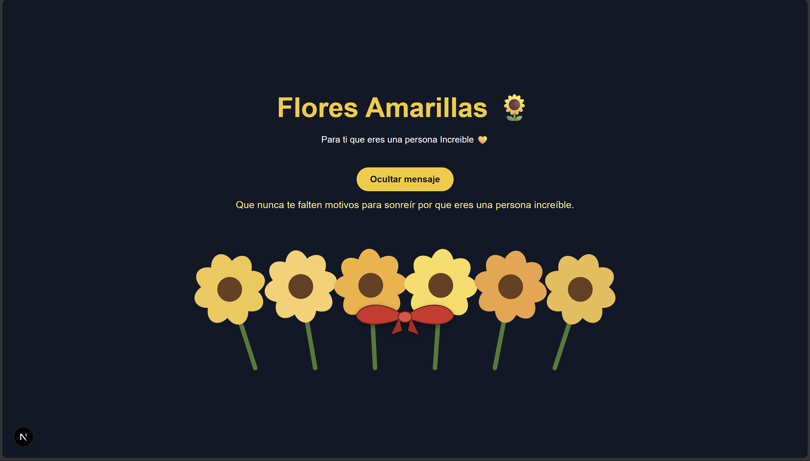

# 🌻 Flores Amarillas — Jardín de Girasoles

Proyecto hecho con Next.js (App Router) que muestra un ramo de girasoles animados e interactivos, amarrados con un listón. Construido siguiendo un tutorial paso a paso, usando **CSS puro** (sin frameworks de estilos).

## 📸 Captura del sitio



## 🧩 Tecnologías usadas

- **Next.js** (App Router) — framework de React
- **React** — librería para construir la interfaz
- **TypeScript** — tipado estático sobre JavaScript
- **CSS puro** — sin Tailwind ni ninguna librería de estilos, todo en `app/globals.css`

## ✅ Requisitos previos (hay que instalarlos en tu computadora, no vienen en el repo)

Antes de clonar el proyecto necesitas tener instalado:

1. **Node.js** (versión 18.18 o superior). Verifica con:
   ```bash
   node -v
   ```
2. **npm** (se instala junto con Node.js). Verifica con:
   ```bash
   npm -v
   ```

No necesitas instalar Next.js, React ni TypeScript por separado — todos esos ya están declarados en `package.json` y se instalan juntos en el siguiente paso.

## 📥 Instalación

Clona el repositorio y entra a la carpeta:

```bash
git clone <URL-de-tu-repositorio>
cd flores-amarillas
```

Instala todas las dependencias del proyecto (lee `package.json` y descarga todo dentro de `node_modules/`, que **no se sube** al repositorio):

```bash
npm install
```

## ▶️ Correr el proyecto en desarrollo

```bash
npm run dev
```

Abre [http://localhost:3000](http://localhost:3000) en tu navegador.

## 🚫 Qué NO hace falta instalar

- **Tailwind CSS** — este proyecto no lo usa, todo el diseño está en CSS puro dentro de `app/globals.css`.
- **Librerías de íconos o UI** (como MUI, Chakra, shadcn, etc.) — no se usan, todos los elementos visuales (flores, pétalos, listón) están hechos a mano con `divs`, `SVG` y CSS.
- **Librerías de manejo de estado** (Redux, Zustand, etc.) — el estado se maneja únicamente con el `useState` propio de React, no hace falta nada externo.
- **Node.js global de otra versión distinta a la recomendada** — no instales varias versiones a la vez; si usas varios proyectos con distintas versiones de Node, considera usar `nvm`.

## 📁 Estructura del proyecto

```
flores-amarillas/
│
├── app/
│   ├── components/
│   │   ├── Flower.tsx      # Componente de un girasol individual
│   │   └── Ribbon.tsx      # Componente del listón que amarra el ramo
│   ├── globals.css         # Todos los estilos del proyecto
│   ├── layout.tsx          # Estructura general de la página
│   └── page.tsx            # Página principal (el jardín/ramo)
│
├── public/                 # Imágenes y archivos estáticos (incluye la captura)
│
├── package.json            # Lista de dependencias y scripts del proyecto
├── tsconfig.json           # Configuración de TypeScript
├── next.config.ts          # Configuración de Next.js
└── README.md                # Este archivo
```

## 📜 Scripts disponibles

| Comando | Qué hace |
|---|---|
| `npm run dev` | Corre el proyecto en modo desarrollo (con recarga automática) |
| `npm run build` | Genera la versión de producción, optimizada |
| `npm run start` | Corre la versión ya construida con `npm run build` |
| `npm run lint` | Revisa el código en busca de errores de estilo con ESLint |